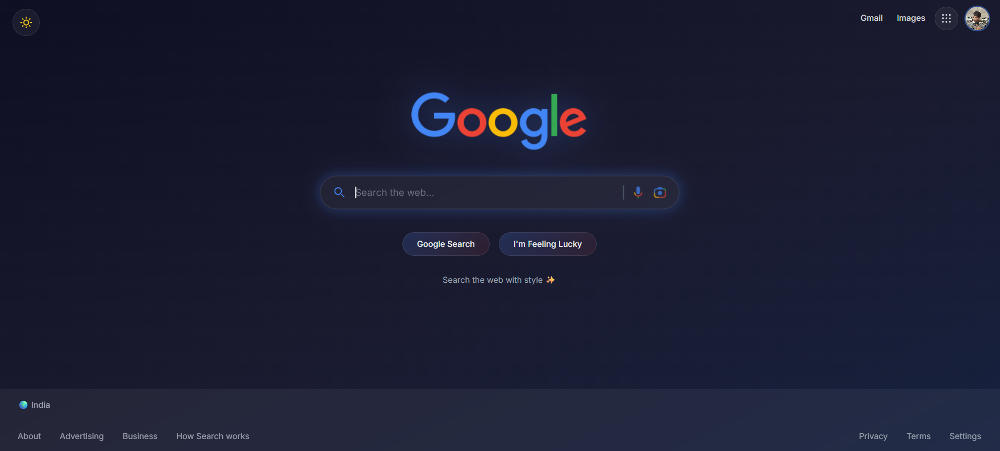

# 🔍 SearchMe - Modern Google Clone

A sleek, modern Google Search clone built with React and Vite. Features a stunning dark/light mode toggle, glassmorphism UI, and real-time search powered by Google Custom Search API.

---

## 🎨 Preview



---

## ✨ Features

- 🌙 **Dark/Light Mode** - Toggle between stunning dark theme and classic light theme
- 🔮 **Glassmorphism UI** - Modern frosted glass effects with glow animations
- 🔍 **Real Search** - Powered by Google Custom Search API
- 🖼️ **Image Search** - Dedicated image search with beautiful grid layout
- 📱 **Fully Responsive** - Works seamlessly on desktop, tablet, and mobile
- ⚡ **Fast & Modern** - Built with Vite for lightning-fast development
- 🎨 **Smooth Animations** - Floating logos, hover effects, and transitions

---

## 🚀 Quick Start

### Prerequisites
- Node.js 16+ 
- npm or yarn
- Google Custom Search API Key & CX

### Installation

```bash
# Clone the repository
git clone https://github.com/alok56mth/searchme.git

# Navigate to project directory
cd searchme

# Install dependencies
npm install

# Start development server
npm run dev
```

### Build for Production

```bash
npm run build
npm run preview
```

---

## 🔧 Environment Variables

Create a `.env` file in the root directory:

```env
VITE_GOOGLE_API_KEY=your_google_api_key
VITE_GOOGLE_CX=your_custom_search_engine_id
```

### Getting API Keys

1. **Google API Key**: [Google Cloud Console](https://console.cloud.google.com/) → Create Project → Enable "Custom Search API" → Create Credentials

2. **Custom Search Engine ID**: [Programmable Search Engine](https://programmablesearchengine.google.com/) → Create Search Engine → Copy ID

---

## 🛠️ Tech Stack

| Technology | Purpose |
|------------|---------|
| ⚛️ React 18 | UI Framework |
| ⚡ Vite | Build Tool |
| 🎨 TailwindCSS | Styling |
| 🔀 React Router | Navigation |
| 📡 Axios | API Requests |
| 🎯 React Icons | Icon Library |

---

## 📁 Project Structure

```
searchme/
├── src/
│   ├── assets/           # Images & icons
│   ├── components/       # React components
│   ├── utils/            # API & Context
│   ├── App.jsx
│   └── index.css
├── .env
├── package.json
└── README.md
```

---

## 🌐 API Usage

This project uses the **Google Custom Search JSON API**.
- **Free tier**: 100 queries/day
- Additional queries require billing

---

## 👨‍💻 Author

**Alok Kumar**

[](https://github.com/Alok56mth)
[](https://www.linkedin.com/in/alok-kumar-45b763226/)

---

## ⭐ Show Your Support

If you found this project helpful, please give it a ⭐ on GitHub!

---

<p align="center">Made with ❤️ and React</p>
